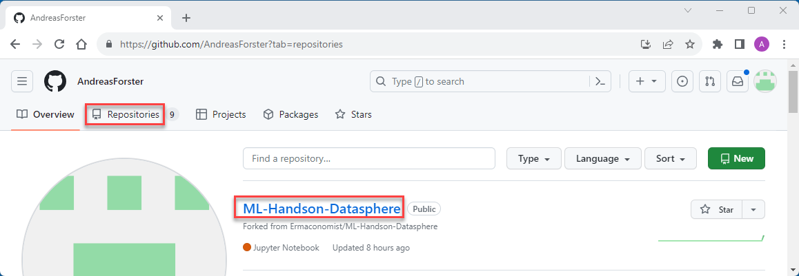

# Fork a Repo: A Comprehensive Guide for Mac Users

A fork is a new repository that shares code and visibility settings with the original "upstream" repository. Forks are often used to propose changes before they are integrated into the main project.

## About Forks

A fork is a new repository that shares code and visibility settings with the original “upstream” repository. Forks are commonly used to iterate on ideas or changes before they are proposed back to the upstream repository. This is especially useful in open source projects or when you do not have write access to the upstream repository. **We need to fork this repository so you can work with the exericse files provided in you own work space**

### Propose Changes to Someone Else's Project

You can use forks to propose changes related to fixing a bug. The general workflow is:

1. Fork the repository.
2. Make the fix.
3. Submit a pull request to the project owner.

## Open Source and Forks

Open source software is based on the idea that sharing code can lead to better, more reliable software. For more information, see "About the Open Source Initiative" and GitHub's white paper "An introduction to innersource."

## Prerequisites

Before forking a repository, set up Git and authenticate with GitHub.com. For more information, see [Setup your Github Account](/01_Assets/01-get-account.md)

## Forking a Repository

You might fork a project to propose changes to the upstream repository. In this case, it's good practice to regularly sync your fork with the upstream repository. To do this, you'll need to use Git on the command line. You can practice setting the upstream repository using the same  [ermaconomist/ML-Handson-Datasphere](https://github.com/Ermaconomist/ML-Handson-Datasphere) repository you just forked.

1. On GitHub.com, navigate to the [ermaconomist/ML-Handson-Datasphere](https://github.com/Ermaconomist/ML-Handson-Datasphere) repository.
1. In the top-right corner of the page, click Fork.

 

3. Under "Owner," select the dropdown menu and click an owner for the forked repository.
4. By default, forks are named the same as their upstream repositories. Optionally, to further distinguish your fork, in the "Repository name" field, type a name.
5. Optionally, in the "Description" field, type a description of your fork.
6. Click Create fork.

*You should now see the forked repository under your account with the name choosen*

 

 
Continue with [Activate your Codespace](../01_Assets/03-activate-codespace.md)

 

 
 

  
More information on how to Fork Setups

  
 

1. [Github Docu on forking](https://docs.github.com/en/get-started/quickstart/fork-a-repo?platform=mac)

